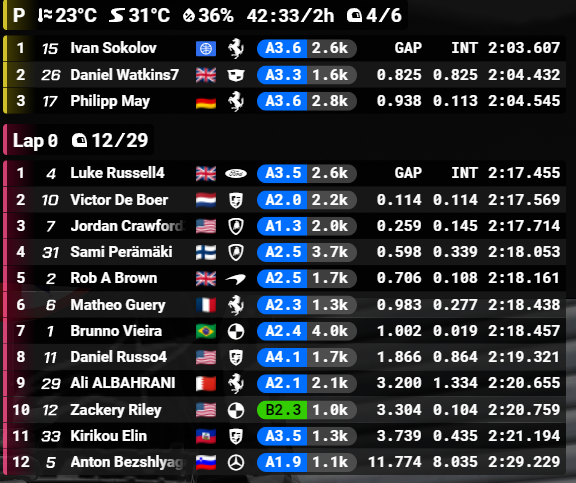
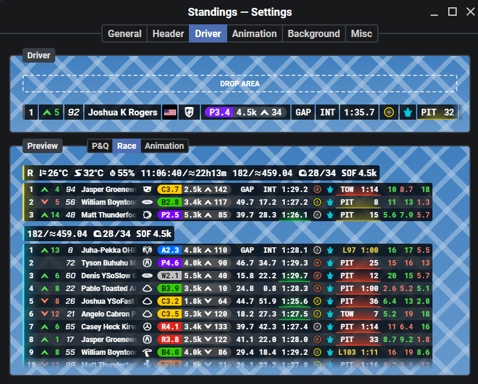
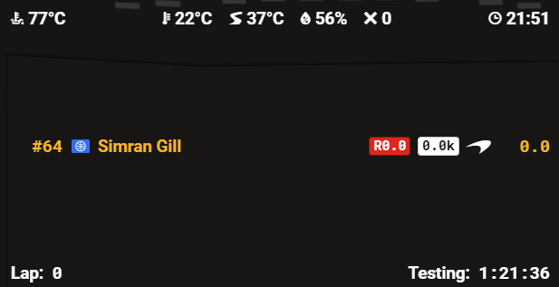
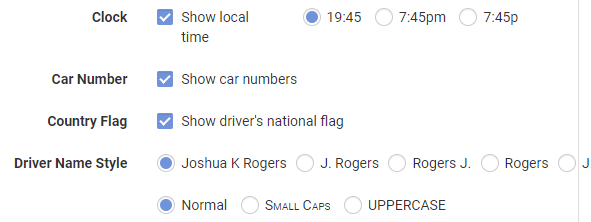
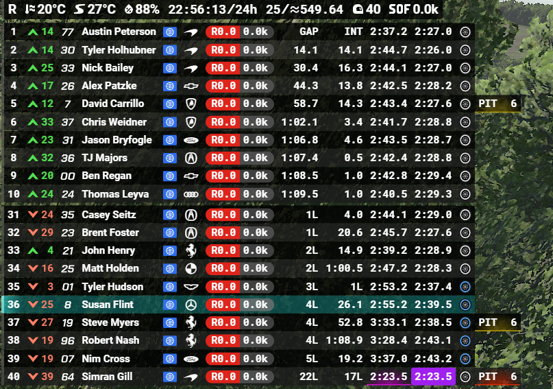
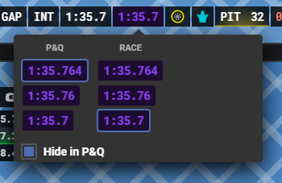
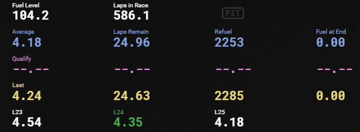
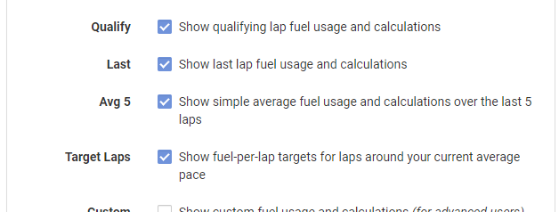

# Kapps Country Flags

A community patch for [Kapps](https://kapps.kutu.ru), the iRacing overlay app whose development has been suspended. It adds a few features Kapps itself never shipped:

- **Country flags** next to each driver in **Standings** and **Relatives**
- A **Fastest Lap column** in **Standings**, highlighting whoever holds the fastest lap within their own class
- A **Target Laps** row in the **Fuel Calculator**, showing the fuel-per-lap needed for a couple of laps around your current pace
- An **Avg 5** row in the **Fuel Calculator**, showing a simple average of your fuel usage over the last 5 laps

## Country flags

Neither Standings nor Relatives shows a driver's country by default. This patch adds a flag icon next to each driver, sourced from the `FlairID` field iRacing's own telemetry already provides (no external API calls, no login required). Drivers without a country set on their iRacing account show a small globe icon instead.

- In **Standings**, the flag is a first-class column fully integrated into the settings editor — it can be dragged, reordered, or removed like any other column.
- In **Relatives**, the flag is a simple on/off toggle (matching how the rest of that widget's settings work) placed right after the "Car Number" option, and displays right after each driver's car number in the overlay.

**Live standings** — a flag appears next to each driver's name during a session:



**Standings settings editor** — the flag is a normal, draggable column (`Country Flag`) alongside the built-in ones:



**Live relatives** — the flag appears right after each driver's car number (drivers without a country set show a globe icon, like Simran Gill below):



**Relatives settings** — a simple "Country Flag" checkbox right after "Car Number":



## Fastest Lap column (Standings)

A new draggable/removable column showing each driver's session-best lap time — addable and reorderable in the settings editor exactly like the built-in columns, with the same P&Q/Race precision options (3 precision levels each) that Last Lap Time has.

Whichever driver currently holds the fastest lap **within their own class** (GT3, LMP2, etc. — computed the same way iRacing itself tracks class-relative fastest laps) gets a solid purple highlight, so it's easy to spot at a glance in multiclass races:



Since a fastest lap in Practice or Qualify is often not that meaningful, the column's settings popup (click/hover the column in the settings editor) has a "Hide in P&Q" checkbox — when enabled, the column stays blank during Practice and any type of Qualify session, and shows normally again in Race:



## Target Laps and Avg 5 (Fuel Calculator)

Two new rows in the Fuel Calculator overlay:

- **Target Laps**, at the bottom of the overlay, shows the fuel-per-lap needed for the lap you're on pace for, plus one lap on either side — so you can see at a glance what adjusting your pace by a lap or two would cost or save in fuel. Toggled on via a "Target Laps" checkbox in the Fuel Calculator's settings, placed above "Custom".
- **Avg 5**, next to the built-in "Average" row, is a simple (non-trimmed) average of your fuel usage over the last 5 laps — useful right after a pace change, when Kapps' own trimmed-average "Average" row is still catching up. Toggled on via an "Avg 5" checkbox, placed above "Target Laps".





## How it works

Kapps ships as a compiled Electron app — there's no source code or build process to hook into. This patch works by directly editing the minified JavaScript/HTML/CSS bundled inside Kapps' `app.asar` archive (unpack → text-patch → repack), the same file format Electron apps use to package their code. `kapps-country-flags-patch.js` does this programmatically against your own local install, using Kapps' own bundled Node.js runtime (via `ELECTRON_RUN_AS_NODE`) — no separate Node.js install required.

Every string replacement the script makes is guarded: it checks the exact original text exists exactly once before changing anything, and aborts without touching the file if it doesn't. This means if a future Kapps update changes the underlying code, the patch fails loudly instead of silently corrupting your install.

## You are responsible for running this

This script modifies a file inside your own local Kapps installation. It is not an official Kapps update, is not affiliated with or endorsed by Kapps' developer, and comes with no warranty. Review `kapps-country-flags-patch.js` yourself before running it if you want to understand exactly what it changes. By running it, you accept responsibility for the outcome — back up anything you care about first (see below for the automatic backup this script itself makes).

## How to use it

1. **Fully quit Kapps** — tray icon → Quit Kapps (not just closing the window).
2. Download `apply-country-flags-patch.bat` and `kapps-country-flags-patch.js` and put them **in the same folder** together (anywhere — Desktop, Downloads, wherever).
3. Double-click `apply-country-flags-patch.bat`.
4. It will locate your Kapps install automatically, back up the original file, and apply the patch. Follow the on-screen prompts.
5. Relaunch Kapps. Open the Standings overlay during a session to see flags; open Standings' settings → Driver tab to see the draggable `Country Flag` and `Fastest Lap` columns. For Relatives, open its settings page and enable the new "Country Flag" checkbox (found right after "Car Number"). For the Fuel Calculator, open its settings and enable "Avg 5" and/or "Target Laps" (found above "Custom").

### Running it manually instead of the `.bat`

If you'd rather not run a `.bat` file, you can invoke the script directly:

```
set ELECTRON_RUN_AS_NODE=1
"%LOCALAPPDATA%\kapps\app-<version>\Kapps.exe" kapps-country-flags-patch.js
```

You can also pass an explicit path to `app.asar` as an argument if you don't want it auto-detected:

```
"%LOCALAPPDATA%\kapps\app-<version>\Kapps.exe" kapps-country-flags-patch.js "C:\path\to\app.asar"
```

## If something goes wrong — restoring the backup

Before making any change, the script copies your current `app.asar` to `app.asar.original-backup` **in the same folder** (it will not overwrite an existing backup on a second run, so you always have the true original). To undo the patch at any point:

1. Fully quit Kapps.
2. Go to `%LOCALAPPDATA%\kapps\app-<version>\resources\`.
3. Delete (or rename) `app.asar`.
4. Copy `app.asar.original-backup` and rename the copy to `app.asar`.
5. Relaunch Kapps — you're back to a completely stock install.

## Requirements

- Kapps installed locally (any recent version — development is suspended, so most users are on the same final build).
- Windows. The script and `.bat` launcher were built and tested on Windows; no other platform has been tried.
